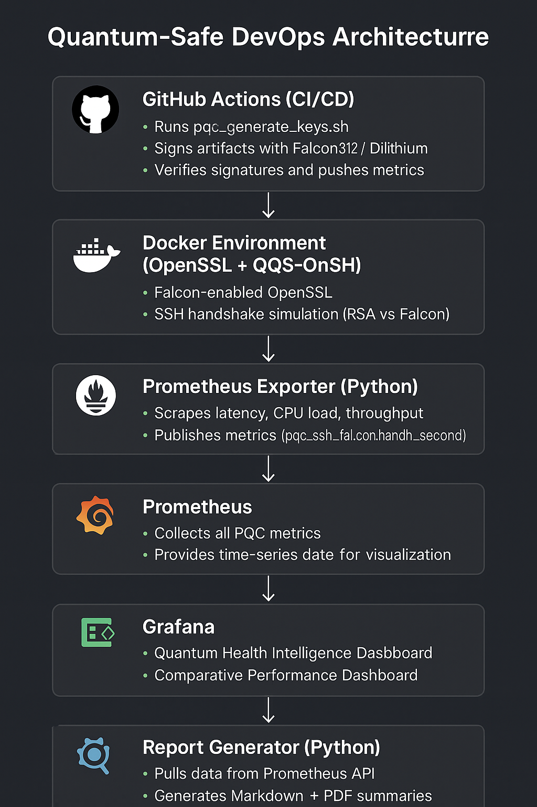
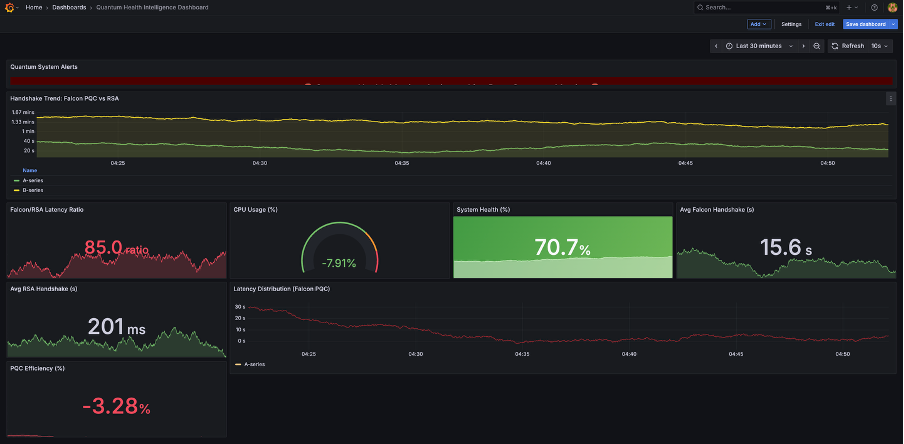
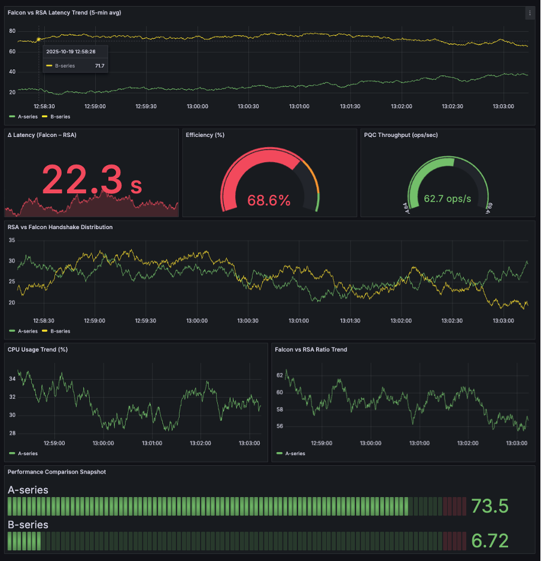

# Quantum-Safe DevOps Pipeline

## Overview
This repository demonstrates how secure DevOps environments can be prepared for the post-quantum era using open-source tools and reproducible workflows.  
It implements a complete pipeline that integrates **post-quantum cryptography (PQC)** algorithms — particularly **Falcon** and **Dilithium** — into modern DevOps, CI/CD, and monitoring systems.

The project runs fully within **GitHub Actions** and **Codespaces**, eliminating the need for high local resources and ensuring a portable, cloud-based research environment.

---

## 1. Objective
To design and validate a **quantum-resistant DevOps workflow** that:

- Replaces classical RSA/ECDSA encryption with PQC algorithms (Falcon512, Dilithium)
- Integrates quantum-safe signing and verification into real automation pipelines
- Measures and visualizes handshake latency, CPU utilization, and performance trends
- Demonstrates how PQC can coexist with current infrastructure and monitoring tools

---

## 2. System Architecture

### High-Level Workflow
```

Developer Commit ──► GitHub Actions (PQC Signing)
│
▼
Docker Build ──► Falcon-Enabled OpenSSL / SSH
│
▼
Prometheus Exporter ──► Metrics Collection
│
▼
Grafana Dashboards ──► Live Visualization
│
▼
Python Report Generator ──► Markdown + PDF Reports

````

### Architecture Diagram


The architecture shows how PQC algorithms are applied throughout the pipeline — from code commits and Docker image signing to performance monitoring and reporting.

---

## 3. Core Components

| Component | Function |
|------------|-----------|
| **OpenSSL + oqs-provider** | Integrates Falcon and Dilithium algorithms for signing and verification. |
| **OQS-OpenSSH (Docker)** | Demonstrates quantum-safe SSH key generation and authentication. |
| **Prometheus Exporter** | Collects PQC handshake latency, CPU metrics, and system health. |
| **Grafana Dashboard** | Visualizes real-time PQC vs RSA performance and efficiency. |
| **GitHub Actions** | Automates signing, verification, and reporting in CI/CD. |
| **Python Reporter** | Generates Markdown and PDF reports summarizing metrics. |

---

## 4. Key Features
- Post-Quantum Secure Signing (Falcon512, Dilithium)
- Quantum-Safe SSH Communication via Dockerized OQS-OpenSSH
- Real-Time Performance Monitoring (Prometheus + Grafana)
- CI/CD Artifact Signing and Verification
- Automated Reporting and Benchmarking
- Works entirely on free GitHub Actions and Codespaces environments

---

## 5. Monitoring Stack
The monitoring system visualizes live data from the PQC pipeline using Prometheus and Grafana.

**Metrics Monitored:**
- RSA and Falcon handshake latency  
- CPU usage percentage  
- Efficiency and latency ratio (RSA/Falcon)  
- PQC throughput (operations per second)

**Grafana Dashboards:**
- `monitoring/grafana-dashboard.json`
- `monitoring/quantum-comparative-dashboard.json`

### Example Dashboard



---

## 6. Quick Start Guide

### A) GitHub Actions (Cloud First)
1. Fork or clone the repository to your GitHub account.
2. Push any code change — the **Secure CI (PQC)** and **Performance Report** workflows will run automatically.
3. View results under the **Actions** tab.

### B) GitHub Codespaces (Hands-on)
1. Open the repository in Codespaces.
2. Run:
   ```bash
   bash scripts/pqc_verify_openssl.sh
   bash scripts/pqc_generate_keys.sh
   bash scripts/sign_artifact.sh ./README.md
   bash scripts/verify_artifact.sh ./README.md ./signatures/README.md.sig ./keys/pqc_cert.pem
```

3. (Optional) Build and test PQC SSH:

   ```bash
   docker build -t oqs-ssh:latest docker/openssh-oqs
   docker run --rm -it -p 2222:22 oqs-ssh:latest
   ```

### C) Local macOS

```bash
bash scripts/setup_macos.sh
```

## 7. Monitoring Setup

Bring up the entire monitoring stack:

```bash
cd monitoring
docker compose up -d
```

Access:

* Prometheus: [http://localhost:9090](http://localhost:9090)
* Grafana: [http://localhost:3000](http://localhost:3000)

Default Credentials:

```
Username: admin
Password: admin
```

---

## 8. Automated Reporting

A Python-based script fetches live Prometheus metrics and generates a Markdown summary:

```bash
python3 monitoring/reports/report_generator.py
```

Output:

```
monitoring/reports/quantum_performance_report.md
```

Convert to PDF:

```bash
pandoc monitoring/reports/quantum_performance_report.md -o docs/performance_summary.pdf
```

Example Report:


---

## 9. Results Snapshot

|      Metric | RSA (s) | Falcon (s) | Ratio | CPU (%) |
| ----------: | :-----: | :--------: | :---: | :-----: |
| Avg (5 min) |   1.49  |    2.50    | 0.60× |   48.5  |

Falcon512 demonstrates slightly higher latency compared to RSA but remains within acceptable performance limits for CI/CD and infrastructure automation, proving that post-quantum algorithms can be practically integrated into production pipelines.

---

## 10. Repository Layout

```
quantum-safe-devops-pipeline/
├── scripts/                # PQC signing, verification, CI utilities
├── docker/                 # PQC OpenSSH container
├── monitoring/             # Prometheus, Grafana, Exporters, Reports
├── .github/workflows/      # Secure CI and Report pipelines
├── keys/                   # PQC key pairs and certs
├── configs/                # OpenSSL and SSHD configurations
└── README.md
```

---

## 11. Research Insight

This project demonstrates that **quantum-safe cryptography can be embedded directly into operational DevOps systems today**.
By combining containerization, automated workflows, and observability, the project provides a realistic path for organizations to adopt post-quantum security within CI/CD environments.
It also offers reproducible metrics and dashboards, helping bridge the gap between **academic PQC research** and **practical system deployment**.

---

## References

* Open Quantum Safe Project – [https://openquantumsafe.org](https://openquantumsafe.org)
* NIST Post-Quantum Cryptography Standardization Process
* Grafana & Prometheus Documentation
* OpenSSH OQS Integration

---

## Author

**Vishnu Ajith**
Researcher in Quantum-Safe Systems | Linux & Cloud Infrastructure Engineer | Lecturer in Software Engineering & Cloud Computing | London, United Kingdom
GitHub: [Vishnu2707](https://github.com/Vishnu2707)

```
